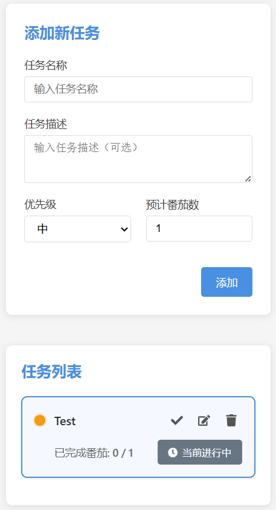
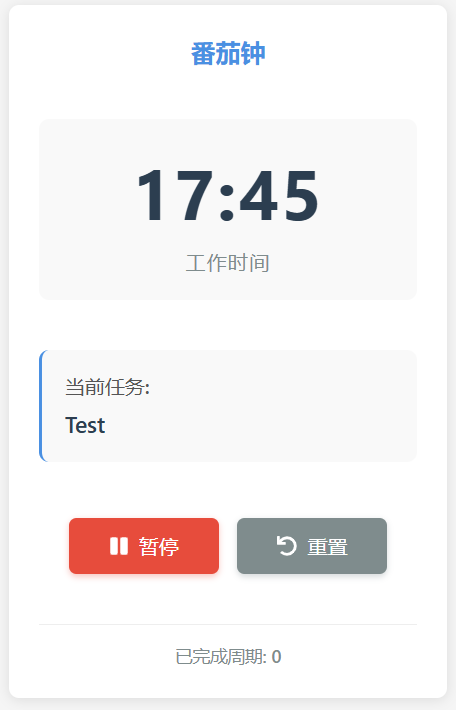
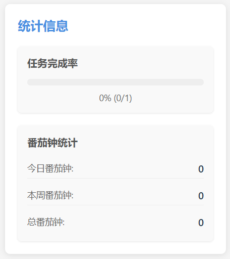

# 任务管理 + 番茄钟应用

一个结合任务管理和番茄钟技术的生产力应用，帮助用户高效管理任务并使用番茄工作法提高工作效率。

## 功能特点

### 任务管理
- 创建、编辑和删除任务
- 设置任务优先级（高、中、低）
- 添加任务描述
- 标记任务完成状态
- 估计任务所需番茄钟数量
- 按优先级和完成状态自动排序任务

### 番茄钟计时
- 标准25分钟工作时间 + 5分钟休息时间
- 可视化倒计时显示
- 工作/休息状态指示
- 周期完成计数
- 完成提示音效

### 数据统计
- 记录每个任务的番茄钟完成情况
- 显示已完成/预估番茄钟比例

### 其他特性
- 数据本地存储，刷新页面不丢失
- 响应式设计，适配不同设备
- 简洁直观的用户界面

## 技术栈

- **前端框架**: React 18
- **构建工具**: Vite 4
- **UI组件**: 自定义组件
- **图标库**: React Icons 4
- **状态管理**: React Hooks (useState, useEffect)
- **数据存储**: 浏览器 localStorage
- **样式**: CSS (模块化CSS文件)

## 安装与运行

### 前提条件

- Node.js (推荐 v14 或更高版本)
- npm 或 yarn 包管理器

### 安装步骤

1. 克隆或下载项目代码

2. 进入项目目录
   ```
   cd 项目目录
   ```

3. 安装依赖
   ```
   npm install
   ```
   或
   ```
   yarn
   ```

4. 启动开发服务器
   ```
   npm run dev
   ```
   或
   ```
   yarn dev
   ```

5. 在浏览器中访问 http://localhost:5173 (或终端中显示的URL)

### 构建生产版本

```
npm run build
```
或
```
yarn build
```

构建后的文件将生成在 `dist` 目录中，可以部署到任何静态文件服务器。

## 使用指南

### 添加任务
1. 在左侧的任务表单中填写任务名称（必填）
2. 可选填写任务描述
3. 选择任务优先级（高、中、低）
4. 设置预计所需的番茄钟数量
5. 点击"添加"按钮

### 管理任务
- 点击任务右上角的"✓"按钮可标记任务为完成/未完成
- 点击"编辑"按钮可修改任务信息
- 点击"删除"按钮可移除任务

### 使用番茄钟
1. 在任务列表中选择一个未完成的任务，点击"开始番茄钟"按钮
2. 在右侧番茄钟区域，点击"开始"按钮启动计时器
3. 专注工作25分钟，计时结束后会自动记录一个番茄钟并进入5分钟休息时间
4. 休息结束后，可以开始新的工作周期
5. 可以随时点击"暂停"按钮暂停计时，或点击"重置"按钮重新开始

### 运行效果

1.任务管理界面



2.番茄钟



3.统计信息



## 许可证

本项目采用 MIT 许可证。详情请参阅 LICENSE 文件。